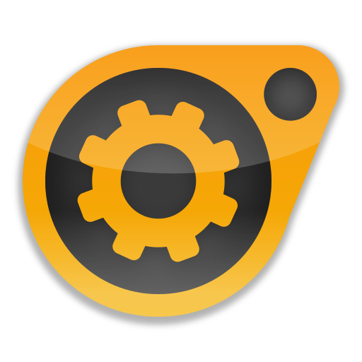
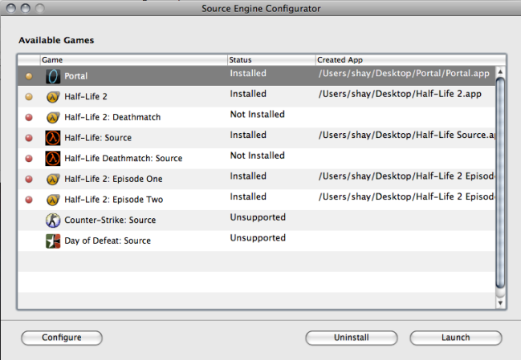

  # Source Engine Configurator

  

  

  Source Engine Configurator is a tool for installing and playing Source Engine games on your PowerPC Mac. It works by patching your existing Windows/Mac/Linux game installation folder into a PowerPC-compatible `.app` bundle. 
  
  Currently, 13 games and 1 Source mod are supported.

  Each game needs to be installed by providing your own legally purchased copy. You can do this by selecting an existing folder copied from another device, or by using the Steam download feature.

  An Ethernet connection is highly recommended for Steam downloads. Secure Steam connections are handled through the `libsteamdepot` library: https://github.com/doctashay/libsteamdepot

  This project is currently an early alpha. Expect bugs, crashes, rendering issues, performance problems, missing effects, audio
  glitches, and game-specific compatibility issues.

  ## Requirements

  - PowerPC G4 or G5 Mac
  - 1.2 GHz or faster CPU recommended
  - 512 MB RAM minimum
  - Mac OS X 10.5.0 or newer
  - Also tested with the PowerPC Snow Leopard alpha
  - Dual-processor G5 strongly recommended

  ## Supported Games

  Configurator supports many Source engine titles, including:

  - Portal
  - Portal 2
  - Team Fortress 2
  - Half-Life: Source
  - Half-Life Deathmatch: Source
  - Half-Life 2
  - Half-Life 2: Episode One
  - Half-Life 2: Episode Two
  - Half-Life 2: Deathmatch
  - Counter-Strike: Source
  - Day of Defeat: Source
  - Left 4 Dead 2
  - The Stanley Parable 
  Some supported titles may still be incomplete or unstable.

  ## Not Supported

  The following games are not currently supported:

  - Left 4 Dead
  - Counter-Strike: Global Offensive
  - Dota 2
  - Garry's Mod

  ## How It Works

  Source Engine Configurator only provides the engine runtime and launcher tooling. It does not include game assets or source code.

  The engine port is a private fork of https://github.com/nillerusr/source-engine. 

  You provide a legitimate Windows, Linux, or Mac install folder for a supported Source game. Configurator verifies the install,
  copies the required game files, applies the PowerPC engine runtime, and creates a standalone Mac `.app`.

  The generated app can then be configured, updated, and launched directly from Configurator.
  
  ## Installation

  1. Select the game you want to install. Then, choose your install method.
  2a. Copy your supported Source game folder to your PowerPC Mac. OR
  2b. Login and download via Steam.
  3. Choose an output destination.
  4. Confirm settings and download/patch.
  5. Configure the game settings to your liking and launch.

  ## Updates

  Source Engine Configurator automatically manages updates to the Source Engine PowerPC runtime - you will be notified when a game update is available. 
  These releases replace only changed engine binaries and support files without requiring the user to reinstall the original
  game data. This allows existing generated `.app` bundles to be patched as the PowerPC port improves.

  ## Legal

  This project does not include Valve game content, game assets, or Source Engine source code.

  You must own a legitimate copy of any game you use with this tool.

  Do not redistribute Valve assets, game folders, maps, models, materials, sounds, scenes, VPKs, or other copyrighted game content.

  This project is provided free of charge for non-commercial preservation, compatibility, and personal-use purposes. Do not sell
  this tool, bundle it with paid products, distribute it behind a paywall, or use it commercially.

  ## Current Status

  This is a work-in-progress PowerPC Source Engine port.

  The current focus areas are:

  - PowerPC rendering correctness
  - ATI and NVIDIA OpenGL driver compatibility
  - Studio model and animation performance
  - Audio timing and stability
  - Broader Source mod compatibility

  ## Roadmap

  Planned or experimental goals include:

  - Better tested Source mod support
  - Native dedicated server support
  - Improved PowerPC/AltiVec optimization
  - Network compatibility with PC servers where possible
  - Source SDK tooling experiments
  - Expanded game compatibility

  ## Credits

  PowerPC port and configurator by doctashay.

  Additional packaging and dependency support from the PPCPorts project.

  Application icon created by maxtron95.

  ## Links

  - GitHub: https://github.com/doctashay/source-engine-configurator
  - PPCPorts Project: https://macos-powerpc.org
